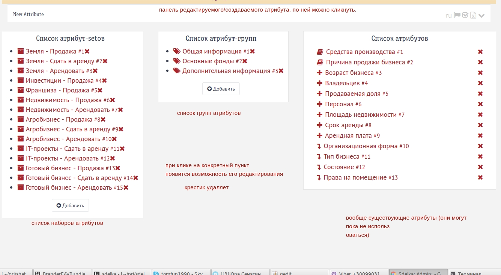
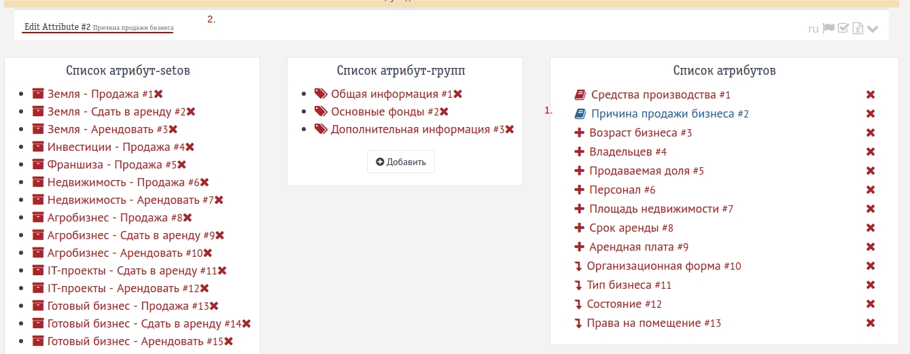
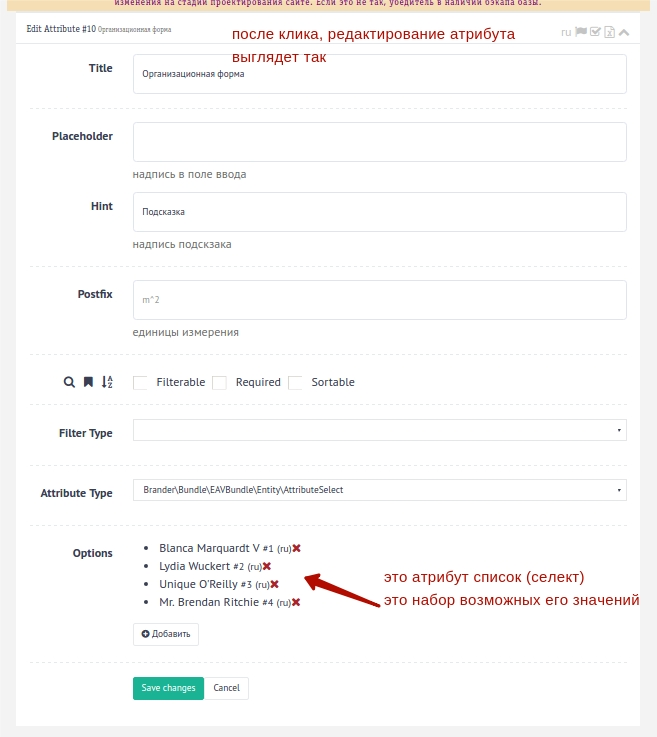

### Как это работает

Есть продукт, у продукта есть **атрибут**ы (например, плотность, цвет, бренд...), 
у конкретного продукта есть **значения атрибутов** (для атрибутов выше: 11g/m^3, red, yahoo).  
Бывают разные типы продуктов, у них должен быть свой **набор атрибутов**, то есть для мобильников задаётся количество 
сим-карточек, а для мыла нет. Наборы атрибутов состоят из атрибутов.
Бывают разные **типы атрибутов**, например цена - это цифра, а бренд - список, и этот список состоит из чётко 
опре делённого набора значений (Yahoo, Marlboro, Huggies), это параметры этого особенного атрибута.
Часто, на сайте отображаются не все атрибуты, например, для листинга отображаются только название и цена,
а на странице описания, они группируются по вкладкам, вкладка "механические свойства", вкладка "мощность и силовые показатели".
Чтобы предоставить администратору сайта возможность управлять набором этих атрибутов, программист, может создать
отдельные **группы атрибутов**, которые и состаят из набора атрибутов, который нужно сгруппировать.

Стартовое окно управления EAVом

Куда кликнуть, чтобы изменить атрибут

Как выглядит страница атрибута

#### Визуальное оформление может измениться, но идея будет той же самой